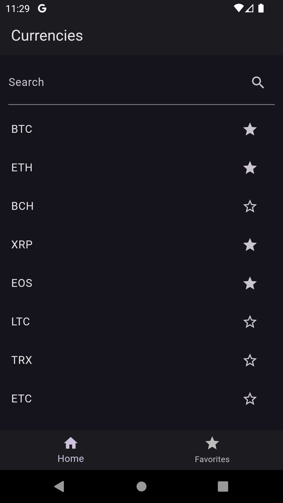
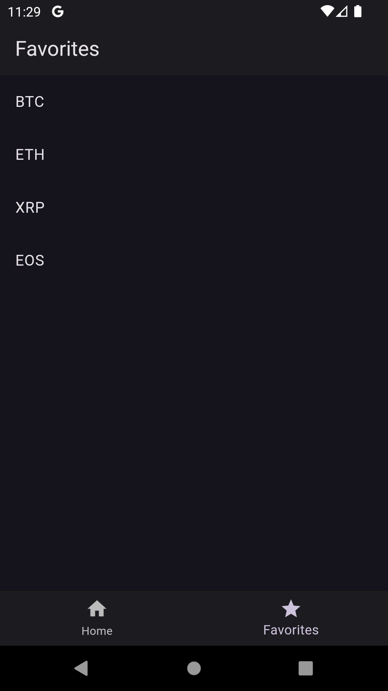
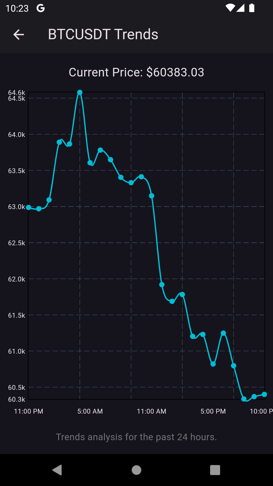

# Crypto Scan

This application is a Flutter project that displays a list of cryptocurrency pairs, allows users to search for specific coins, and mark them as favorites. It utilizes data from the Binance API to retrieve and display real-time price data and daily changes for each cryptocurrency.

## Features

- **List of Cryptocurrencies**: Shows the first 25 cryptocurrency pairs from the Binance API.
- **Search Functionality**: Allows users to search for specific cryptocurrency pairs.
- **Favorites**: Users can mark and view their favorite cryptocurrencies.
- **Real-Time Updates**: Displays real-time price data and daily changes using WebSocket.

## Technical Guidelines

- **API**: Cryptocurrency pairs are retrieved from the [Binance API](https://www.binance.com/fapi/v1/exchangeInfo). For more details, see the [Binance API Documentation](https://binance-docs.github.io/apidocs/futures/en/#exchange-information).
- **Real-Time Data**: Utilizes WebSocket market streams for real-time updates. More information can be found [here](https://binance-docs.github.io/apidocs/futures/en/#websocket-market-streams).

## Getting Started

### Prerequisites

Ensure you have Flutter installed on your development machine. The app is built using:

- Flutter 3.19.3
- Dart 3.3.1

### Installation

1. Clone the repository:
   ```bash
   git clone https://github.com/iqbaltld/crypto_scan.git
   ```
2. Navigate to the project directory:
   ```bash
   cd crypto_scan
   ```
3. Install dependencies:
   ```bash
   flutter pub get
   ```
4. Generating Code with Build Runner:
   ```bash
   flutter pub run build_runner build --delete-conflicting-outputs
   ```

### Run the App

4. After installation, run the app using the following command:
   ```bash
   flutter run
   ```

### About Key Dependencies

### Flutter Bloc

flutter_bloc is a package that implements the BLoC (Business Logic Component) pattern, providing a predictable state management solution that helps to separate presentation from business logic in Flutter applications. This package facilitates easy state management with features like streaming of states, event handling, and integrating with the Flutter widget tree, making it a cornerstone for reactive and maintainable architectures.

### Freezed

Freezed is a code generation package that creates immutable and sealed classes for Flutter/Dart, enhancing type safety and reducing boilerplate in state management.

### JSON Serializable

json_serializable automates the process of converting JSON data to and from Dart objects, simplifying interactions with web services by generating necessary serialization boilerplate.

### JSON Annotation

json_annotation provides annotations for json_serializable to specify rules for serializing Dart objects, such as field renaming and ignoring fields.

### Freezed Annotation

freezed_annotation supplies annotations for the freezed package, directing how to generate immutable classes and ensuring properties and methods conform to specified behaviors.

## Screenshots

<p align="center">
  
  
  
</p>
